# KernelShield


[](https://github.com/ThaRealJozef/KernelShield/actions/workflows/build.yml)

**KernelShield** is an experimental eBPF security engine built to explore Linux kernel internals. It combines high-performance network filtering (XDP) with system integrity monitoring (Tracepoints) and active file blocking (LSM) into a unified Go-controlled framework.

## Architecture

```mermaid
flowchart LR
    subgraph Kernel["🔒 Kernel Space"]
        XDP["⚡ XDP Firewall"] -->|DROP| NIC["Network Driver"]
        LSM["🛡️ LSM Enforcer"] -->|EPERM| VFS["Filesystem"]
        TP["📡 Tracepoints"] --> RB["Ring Buffer"]
    end
    subgraph User["🖥️ User Space"]
        GO["Go Controller"] --> XDP
        GO --> LSM
        GO --> TP
        RB -->|Events| GO
    end
    style Kernel fill:#1a1a2e,stroke:#16213e,color:#eee
    style User fill:#0f3460,stroke:#16213e,color:#eee
```



## Demo

<!-- Replace with your asciinema-agg generated GIF -->


## Features

| Capability | KernelShield | iptables | Falco | Tetragon |
|------------|:------------:|:--------:|:-----:|:--------:|
| **XDP Speed** (Driver-level filtering) | ✅ | ❌ | ❌ | ✅ |
| **LSM Blocking** (Active file protection) | ✅ | ❌ | ❌ | ✅ |
| **Syscall Audit** (Ring Buffer events) | ✅ | ❌ | ✅ | ✅ |
| **Lightweight** (Single binary) | ✅ | ✅ | ❌ | ❌ |
| **Go SDK** (cilium/ebpf) | ✅ | ❌ | ❌ | ✅ |
| **CO-RE Support** | ✅ | N/A | ✅ | ✅ |

## Quick Start

```bash
# 1. Install dependencies (Ubuntu/Debian)
sudo apt update && sudo apt install clang llvm libbpf-dev bpftool make golang-go

# 2. Build
make all

# 3. Run (requires root)
sudo ./kernelshield
```

## Verification

**Network Firewall:**
```bash
ping -c 4 127.0.0.1  # 100% packet loss (blocked by XDP)
```

**System Monitor:**
```bash
cat /etc/shadow  # Triggers: [ALERT] 🚨 SENSITIVE ACCESS: ...
```

**LSM Enforcer** (if `lsm=...,bpf` is enabled):
```bash
cat /etc/shadow  # Returns: Permission denied
```

## Prerequisites

* **Platform**: Linux with BTF (tested on WSL2 Ubuntu)
* **Kernel**: 5.4+ (5.8+ for Ring Buffer, 5.7+ for LSM)
* **Tools**: `clang`, `llvm`, `make`, `bpftool`, `go 1.22+`

## License

Dual BSD/GPL (standard for eBPF kernel compatibility)
